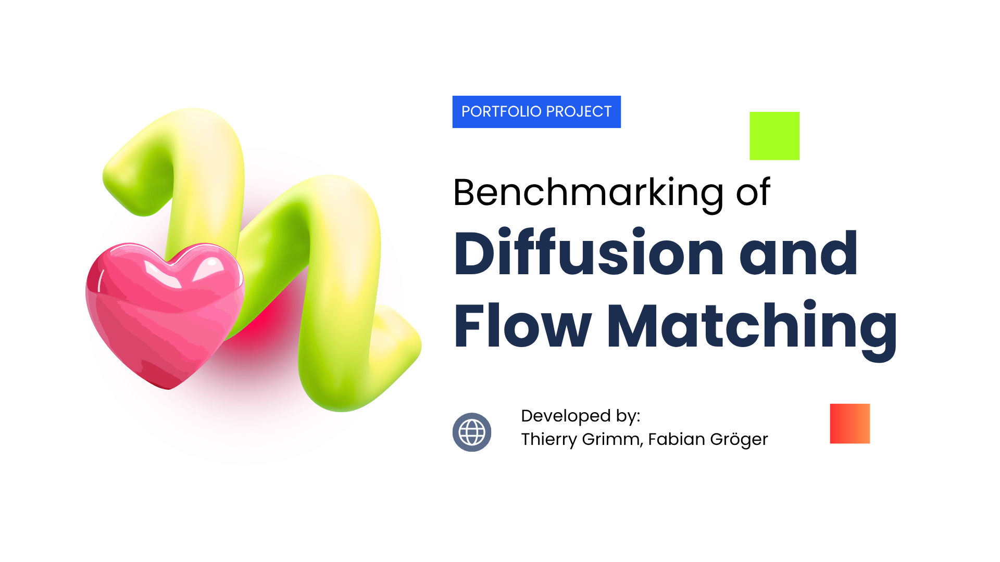
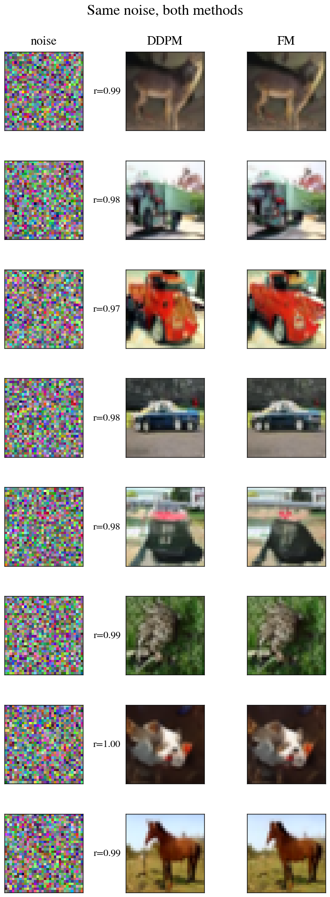
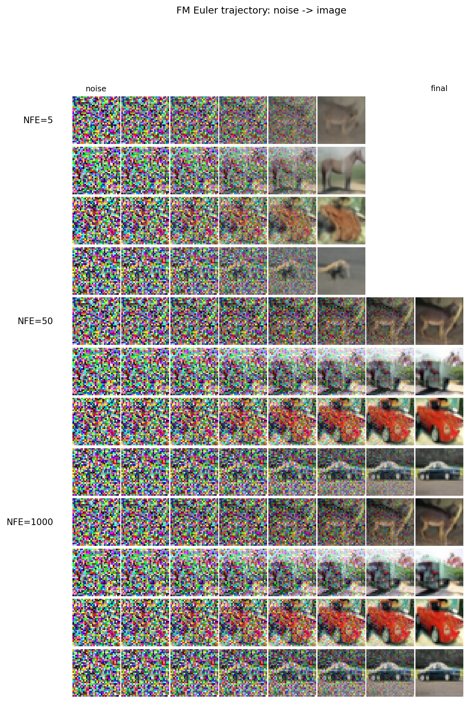
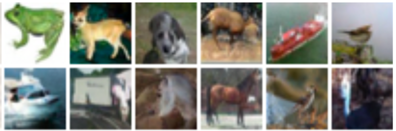
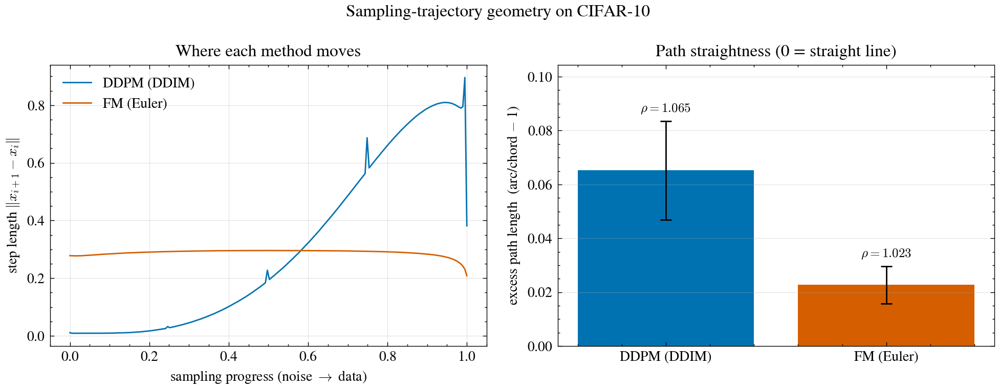

<a name="readme-top"></a>



# go-with-the-flow

<div align='left'>

[](https://www.python.org/) [](https://pytorch.org/) [](https://www.docker.com/) [](https://wandb.ai/)

</div>

<details>
  <summary>Table of Contents</summary>
  <ol>
    <li>
      <a href="#project-description">Project description</a>
    </li>
    <li>
      <a href="#system-architecture">System Architecture</a>
    </li>
    <li>
      <a href="#files-and-data-description">Files and data description</a>
    </li>
    <li>
      <a href="#getting-started">Getting Started</a>
      <ul>
        <li><a href="#requirements">Requirements</a></li>
        <li><a href="#setup">Setup</a></li>
        <li><a href="#smoke-test">Smoke test</a></li>
        <li><a href="#training">Training</a></li>
        <li><a href="#evaluation">Evaluation</a></li>
      </ul>
    </li>
    <li>
      <a href="#data-background">Data background</a>
    </li>
    <li>
      <a href="#experimental-setup">Experimental setup</a>
    </li>
    <li>
      <a href="#issues">Issues</a>
      <ul>
        <li><a href="#troubleshooting">Troubleshooting</a></li>
        <li><a href="#filing-an-issue">Filing an issue</a></li>
      </ul>
    </li>
    <li><a href="#acknowledgments">Acknowledgments</a></li>
  </ol>
</details>

## Project description

**go-with-the-flow** is a reproducible experimental framework for comparing **DDPM** and **Flow Matching** on CIFAR-10 under aligned model capacity and training settings. The repository focuses on fair, side-by-side evaluation of generative quality, compute efficiency, and likelihood behavior. This repository was developed as course project **A1**.

<p align="center">
  
  <br/>
  <em>Figure 1: Side-by-side generated samples from the paper-sized DDPM and FM models.</em>
</p>

:star2: **Highlights:**
1. Budget-matched comparison: DDPM and Flow Matching are evaluated under equal architecture, training budget, and NFE constraints.
2. Main empirical result: FM (Euler) outperforms DDPM (DDIM) at every tested matched NFE point (`5, 10, 20, 50, 100, 250`) in this study.
3. Efficiency finding: FM reaches near-best quality with far fewer evaluations (e.g., competitive quality at ~`100` NFE versus DDPM best at `1000` NFE).
4. Runtime impact: wall-clock analysis shows a substantial practical speedup for FM at near-best quality (about `12.5x` in this run).
5. Geometric interpretation: trajectory/geometry diagnostics indicate smoother, straighter FM transport paths, consistent with its sampling-efficiency advantage.

---

## System Architecture

The project is organized as a modular research pipeline. A shared U-Net implementation is used by both methods, while method-specific losses and samplers are isolated in dedicated modules. The workflow is:

1. train DDPM and FM with matched architecture/optimization settings,
2. evaluate checkpoints with NLL, sample grids, and FID-vs-NFE sweeps,
3. generate aggregate comparison plots from stored metrics.

Training periodically evaluates FID with a fast sampler, checkpoints best/latest weights, and logs metrics for reproducibility.

During evaluation, the framework loads the best checkpoint, swaps EMA weights, and runs three deliverables:
- **NLL estimation** for bits/dim on CIFAR-10 test data.
- **Sample grids** for qualitative inspection.
- **NFE sweeps** with per-config FID and wall-clock timing.

This design keeps method logic explicit while preserving comparable compute and architecture assumptions across DDPM and FM.

## Files and data description

**Project structure:**

```
project/
├── src/                      # Core implementation (methods, data, metrics, training/eval)
│   ├── methods/              # Shared U-Net + DDPM/FM implementations
│   ├── data/                 # CIFAR-10 data handling
│   ├── metrics/              # FID and metric interfaces
│   ├── run.py                # Training entrypoint
│   ├── eval.py               # Evaluation entrypoint (NLL + grid + sweep)
│   ├── plot.py               # Cross-method plotting utilities
│   └── smoke.py              # Short smoke test pipeline
├── results/                  # Checkpoints, sweeps, trajectories, and figures
├── Makefile                  # Reproducible command targets
├── requirements.txt          # Python dependencies
├── Dockerfile                # Containerized runtime setup
├── PROJECT_REPORT.md         # Project report and findings
└── README.md                 # This file
```

Core outputs are written to `results/<method>_<size>/` (checkpoints, logs, samples, sweeps), while cross-method comparison plots are saved under `results/`.

Key module map:

| Path | Role |
|---|---|
| `src/methods/base.py` | `GenerativeMethod` ABC |
| `src/methods/unet.py` | Shared U-Net backbone (`small`, `paper` sizes) |
| `src/methods/ddpm.py` | DDPM (DDIM + ancestral + Heun samplers) |
| `src/methods/flow.py` | Conditional flow matching (Euler + RK45 + Heun) |
| `src/methods/__init__.py` | `build()` and `load_method()` (checkpoint + EMA loader) |
| `src/data/` | `DatasetBuilder` ABC + CIFAR-10 |
| `src/metrics/` | `Metric` ABC + FID (with mean/cov decomposition support) |
| `src/train.py` | Training loop (EMA, grad clip, warmup, checkpoints) |
| `src/evaluate.py` | Feed real + generated batches to metrics |
| `src/ema.py` | EMA helper |
| `src/smoke.py` | Smoke entry point (short training run) |
| `src/run.py` | Real training entry point |
| `src/eval.py` | Eval entry: NLL + sample grid + FID-vs-NFE sweep |
| `src/plot.py` | FID-vs-NFE + FID-vs-wall-clock paper plots |
| `src/plot_samplers.py` | Sampler ablation (all samplers overlaid) + FID decomposition |
| `src/plot_training.py` | Training-loss + eval-FID vs step plots (from W&B) |
| `src/geometry.py` | Trajectory straightness (arc/chord, speed, angle) |
| `src/paired.py` | Same-noise DDPM/FM paired samples + nearest-train check |
| `src/trajectory.py` | Noise-to-image evolution at varying NFE budgets |
| `src/config.py` | Smoke run config |

<p align="right">(<a href="#readme-top">back to top</a>)</p>

---

## Getting started

### Requirements

- Python 3.10+ (or Docker runtime)
- NVIDIA GPU recommended for paper-scale runs
- CUDA-compatible driver for Docker workflows
- Optional: Weights & Biases account/API key for experiment tracking

### Setup

Run in Docker (recommended for reproducibility):

```bash
make run_bash_local      # CUDA 12.1 (driver <= 535)
make run_bash_server     # CUDA 12.8 (Blackwell-capable)
make help                # list all available targets
```

Run locally (no Docker):

```bash
pip install torch torchvision
make install
```

### Smoke test

Train one method for 500 steps, then compute FID:

```bash
make smoke_local METHOD=ddpm SIZE=small
make smoke_server METHOD=fm SIZE=paper
```

`METHOD={ddpm,fm}` and `SIZE={small,paper}` (`small` ~9M params, `paper` ~35.7M params, matching Ho et al.).

### Training

Paper-exact training uses fp32, Adam (`lr=2e-4`, `wd=0`), EMA `0.9999`, grad clip `1.0`, warmup `5000`, batch `128`, dropout `0.1`, and periodic FID-driven checkpointing to `results/<method>_<size>/`.

```bash
make train_local METHOD=ddpm SIZE=paper N_STEPS=100000
make train_server METHOD=fm SIZE=paper N_STEPS=100000
```

Resume interrupted training from `latest.pt`:

```bash
make train_local METHOD=ddpm SIZE=paper RESUME=--resume
```

Periodic FID during training uses fast samplers (DDIM for DDPM, Euler for FM), while final paper-level FID is produced separately during evaluation.

### Evaluation

One command runs all metrics against `results/<method>_<size>/best.pt`:

```bash
make eval_server METHOD=ddpm SIZE=paper
make eval_server METHOD=fm   SIZE=paper
```

This loads the checkpoint, swaps EMA in, and writes:
- `nll.json` - bits/dim on the test set (`N_SAMPLES_NLL=1024` by default)
- `samples.png` - 64-image grid from the paper sampler (ancestral for DDPM, RK45 for FM)
- `sweep.jsonl` - FID + wall-clock per `(sampler, steps)` config (`N_SAMPLES_FID=10000`)

Sweep coverage is 13 configs per method:
- 6 first-order points (DDIM/Euler at NFE `5/10/20/50/100/250`)
- 6 Heun second-order points matched to the same NFE grid
- 1 adaptive paper sampler (DDPM ancestral `T=1000`, FM RK45 around `145` NFE)

Each sweep entry also carries `fid_mean_term` + `fid_cov_term` (used by the Heun ablation/decomposition view). The sweep is resume-safe: stop/re-run continues from the last completed config.

Skip individual stages with:

```bash
# add flags as needed
# --skip-nll --skip-grid --skip-sweep
```

Build comparison plots after both methods finish:

```bash
make plot_server SIZE=paper
```

Expected outputs:
- `results/fid_vs_nfe_paper.png` (top: FID vs NFE; bottom: FM advantage %)
- `results/fid_vs_wallclock_paper.png` (FID vs wall-clock; shows RK45 cost)

Sampler-ablation and decomposition plots:

```bash
make plot_samplers_server SIZE=paper
```

Expected outputs:
- `results/fid_vs_nfe_samplers_paper.png` (all samplers overlaid)
- `results/fid_decomp_paper.png` (Heun-focused FID decomposition)

Trajectory visualization (noise to image, low/mid/high NFE side by side):

```bash
make trajectory_server METHOD=ddpm SIZE=paper
make trajectory_server METHOD=fm   SIZE=paper
```

Geometry diagnostics (arc/chord straightness + speed + angle):

```bash
make geometry_server SIZE=paper
```

Expected outputs:
- `results/geometry_paper.png`
- `results/geometry_paper.json`

Paired sampling diagnostics (same-noise DDPM vs FM + nearest-train):

```bash
make paired_server SIZE=paper
```

Expected outputs:
- `results/paired_paper.png`

Training-dynamics plot from W&B:

```bash
make plot_training_server SIZE=paper
```

Expected outputs:
- `results/loss_fid_vs_step_paper.png`

Example trajectory output (Flow Matching diagnostic):

<p align="center">
  
  <br/>
  <em>Figure 3: Flow Matching trajectory from noise to sample at different solver depths.</em>
</p>

Useful runtime notes:
- `METHOD={ddpm,fm}`
- `SIZE={small,paper}` (`small` ~9M params, `paper` ~35.7M params)
- First run downloads CIFAR-10 (~170 MB) and InceptionV3 FID weights (~95 MB)
- W&B is enabled by default (`go-with-the-flow` project); set `WANDB_API_KEY` in your shell, or use `WANDB_MODE=disabled` to skip
- Older notes may reference `.svg` filenames (for example `samples.svg`, `fid_vs_nfe_paper.svg`, `fid_vs_wallclock_paper.svg`, `fid_vs_nfe_samplers_paper.svg`, `trajectory.svg`, `geometry_paper.svg`, `paired_paper.svg`); current default outputs in this repository are `.png`.

<p align="right">(<a href="#readme-top">back to top</a>)</p>

---

## Data background

The benchmark dataset is **CIFAR-10**:
- **Split:** 50,000 training images and 10,000 test images.
- **Format:** 32x32 RGB natural images across 10 classes.
- **Preprocessing:** normalization to `[-1, 1]`, random horizontal flips in training.
- **Source:** [CIFAR-10 dataset page](https://www.cs.toronto.edu/~kriz/cifar.html)

This project uses CIFAR-10 as a controlled benchmark to compare generative modeling strategies (diffusion vs. flow matching) under shared architecture and optimizer constraints.

A CIFAR-10 image grid is shown below (see Figure 4):

<p align="center">
  
  <br/>
  <em>Figure 4: CIFAR-10 image grid used as the training and evaluation benchmark.</em>
</p>

---

## Experimental setup

**Data.** CIFAR-10 (50k train, 10k test), 32x32 RGB, normalized to `[-1, 1]`. Random horizontal flip on train; no flip on eval. PyTorch DataLoader with `pin_memory` and `persistent_workers`.

**Shared backbone.** Ho et al. DDPM++-style U-Net shared by both methods for a fair A/B on objective and sampler choices. `SIZE=paper` uses `base=128`, `ch_mults=(1,2,2,2)` (~35.7M params), while `SIZE=small` uses `base=64` (~9M params). Configuration includes 2 ResBlocks per down level + 3 per up level (`num_res_blocks + 1`), self-attention at `16x16`, GroupNorm(32), SiLU, dropout `0.1`, stride-2 downsample, nearest+conv upsample, sinusoidal time embedding, Xavier-uniform Conv/Linear init, and zero-init on residual/attention output projections.

**DDPM configuration.** `T=1000` linear beta schedule (`1e-4 -> 0.02`), `L_simple` training loss (`((eps - noise)**2).mean()` without `1/(2*sigma^2)` reweighting), DDIM (`eta=0`) for fast/periodic evaluation, ancestral sampling (`fixedlarge`) for paper-style generation, and Heun (2nd-order probability-flow ODE view) for sampler ablation.

**Flow Matching configuration.** ICFM with linear/OT interpolant and `sigma_min=1e-4` (without OT batch coupling). Loss: `||v_theta - (x_1 - (1-sigma_min)*x_0)||^2`, `t ~ Uniform[0,1]`. Uses fixed-step Euler for NFE sweeps, adaptive RK45 (`dopri5`, typically around `145` NFE) for paper-style sampling, and Heun for sampler-ablation plots.

<p align="center">
  
  <br/>
  <em>Figure 2: Experiment-derived diffusion vs. flow-matching geometry comparison.</em>
</p>

**Training configuration.** Adam (`lr=2e-4`, `wd=0`), batch size `128`, fp32, gradient clipping at `1.0`, LR warmup over `5000` steps, EMA decay `0.9999` with warmup ramp.

**Evaluation configuration.** FID via InceptionV3 features; periodic training-time FID uses fast samplers (`DDIM-100` / `Euler-50`) for checkpoint selection. Eval-time sweep uses 10k samples per config across 13 configs per method (6 first-order, 6 Heun, 1 adaptive), with wall-clock tracked for FID-vs-wall-clock analysis.

**NLL details.** NLL (bits/dim) is computed in `eval.py`. DDPM uses the full VLB decomposition (`L_T`, per-step `L_{t-1}` with fixedsmall variance, and decoder `L_0` term). FM uses Hutchinson-trace divergence estimation along reverse-time ODE integration (`dopri5`). Both apply a `+log2(128)` dequantization offset for discrete bits/dim reporting.

**Hardware baseline.** Single NVIDIA RTX A6000 (48 GB VRAM), Docker workflows using CUDA-compatible runtime targets.

---

## Issues

### Troubleshooting

- If you get "port already in use" issues in containerized workflows, stop conflicting services first.
- If dependencies are missing, re-run `make install` or `pip install -r requirements.txt`.
- If CUDA is unavailable, verify your host driver matches the selected Docker target.
- If FID evaluation fails on first run, confirm model weight downloads completed successfully.
- If sweeps are interrupted, re-run the same command; evaluation is resume-safe per config.

### Filing an issue

- Open an issue in the repository with:
  - environment details (OS, GPU, CUDA, Python)
  - exact command used
  - full error message/stack trace
  - expected vs observed behavior

---

## Acknowledgments

- This project builds on foundational work in denoising diffusion probabilistic models and flow matching.
- We acknowledge the CIFAR-10 benchmark and the open-source ecosystem that enables reproducible generative modeling research.
- Infrastructure and tooling support includes PyTorch, TorchMetrics, Docker, and Weights & Biases.

